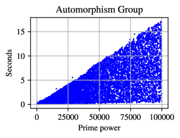

# Isomorphism

We provide two functions dealing with isomorphisms of $E$-groups. One for deciding isomorphism between two $E$-groups, and the other for constructing a generating set for the automorphism group of such groups. These algorithms are based on [(Theorem E) Maglione&ndash;Stanojkovski](https://arxiv.org/abs/2212.03941).

## EGAutomorphismGroup

**Input**:

- `GrpPC` $G$.

**Output**:

- `GrpAuto` $A$.

Return $A=\mathrm{Aut}(G)$ provided $G$ is an $E$-group. 

As we record in [Maglione&ndash;Stanojkovski](https://arxiv.org/abs/2212.03941), the theoretical performance of `EGAutomorphismGroup` is $O(|G|^{1/9})$, and the actual performance can be observed in the following scatter plot of data.

## EGIsIsomorphic

**Input**:

- `GrpPC` $G$,
- `GrpPC` $H$.

**Output**:

- `BoolElt`,
- `Map` $\varphi$. 

Decide if $G$ and $H$ are $E$-groups and if $G\cong H$, and if so return an isomorphism $\varphi : G \to H$. 

